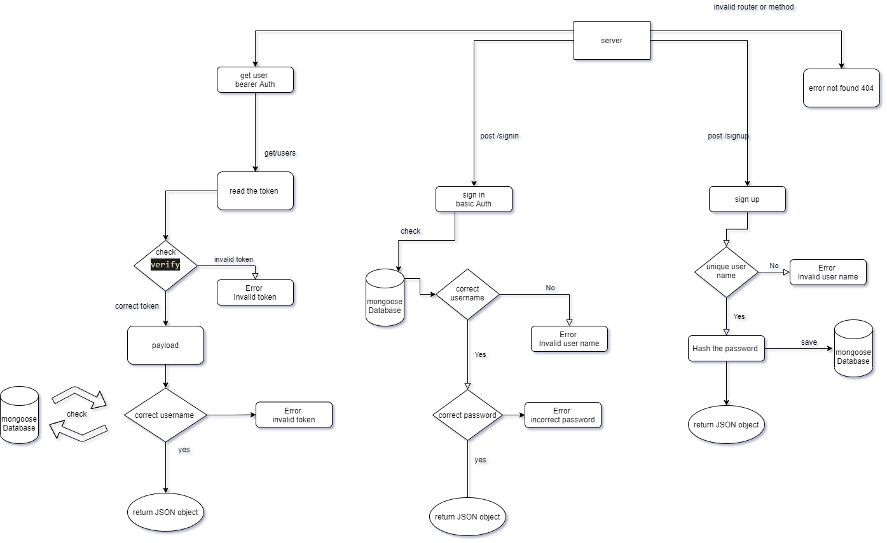

# basic-api-server


**V1.1**

## Author 

Mousa Sabah

## About 

Express server that implements Basic Authentication, with **signup** and **signin** capabilities, using a Mongo database for storage.
## Deployment 
This project use Heroku to deployment

API Live Url: **https://mousa-basic-auth.herokuapp.com/**

## Pull Request 

This is the Main Pull Request for this project :

https://github.com/MousaSbbah/basic-auth/pull/2

## Setup
   .env requirements

      PORT - 3030
      MONGOOSE_URI -  mongodb://********************
## Running the app
```
npm start
```
Endpoint: 
* `/signup`
  After sign up with you unique username the server will Return JSON objects for your info 
    ```json
      [
        {
    "_id": "60aac2f016ea1300151a5a15",
    "username": "User03",
    "password": "$2b$10$V9k1bLak6aObNxm4iTe0J.qsBRjK8n18hU.z0aQBalDZFEIWYa9oy",
    "__v": 0
}
      ]
    ```
* `/signin`
After sign in with correct username and password the server will 
    Return JSON objects 
    ```json
      [
        {
      "name": "dog",
      "legs": 4,
      }
      ]
    ```

## Tests
Github actions link :**https://github.com/MousaSbbah/basic-auth/runs/2651398784?check_suite_focus=true**

**Unit Tests:**
```
npm run test
```
and to try the server you can use this [Web Application](https://javascript-401.netlify.app/basic-auth)

## 
    
## UML



